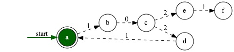
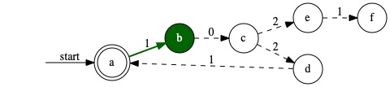
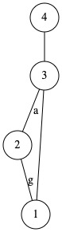
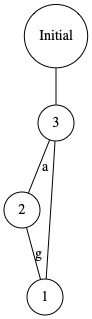

# REST-API
This file contains a sketch of the IPM REST-API between the client and the server. It will serve as an interface for sending and manipulating different kinds of models defined in a user-specified <code>.mc</code> file. The API is divided into three main categories:
- INIT
- TRANSITION
- OUTPUT

The response to all requests include a data object with one or several models where each model has the following attributes:
- <code>type</code> - Ex: "dfa", "nfa", "graph".
- <code>id</code> - A unique number used for model specific requests.
- <code>model</code> - The data needed for the model. Ex: { "nodes" : [], "edges" : []} for a graph.
- <code>simulation</code> - An object with simulation information (only included for models with simulation). Includes five configuration steps at a time, or as many as there are left.

## INIT

#### REQUEST - ALL MODELS
The following request retrieves all the models defined in the user-specified <code>.mc</code> file. The models is returned in their initial state.

<code>GET: BASE_URL + "/all-models"</code>

###### Sample output
```json
{
    "data" : {
        "models" : [
            {
                "type" : "dfa",
                "id" : 0,
                "model" : {
                   "states" : [
                      {"name":"s0", "displayName": "start state" }
                      ,{"name":"s1", "displayName": "s1" }
                      ,{"name":"s2", "displayName": "s2" }
                      ,{"name":"s3", "displayName": "accept state" }
                    ],
                    "transitions" : [
                      {"from": "s0", "to": "s1", "label": "1"}
                      ,{"from": "s1", "to": "s1", "label": "1"}
                      ,{"from": "s1", "to": "s2", "label": "0"}
                      ,{"from": "s2", "to": "s1", "label": "1"}
                      ,{"from": "s2", "to": "s3", "label": "0"}
                      ,{"from": "s3", "to": "s1", "label": "1"}
                    ], 
                    "startState" : "s0",
                    "acceptedStates" : ["s3"]
                },
                "simulation" : {
                    "input" : ["1","0","0","1","0","1","0"],
                    "configurations" : [
                    {"state": "s0","status": "OK"}
                    ,{"state": "s1","status": "OK"}
                    ,{"state": "s2","status": "OK"}
                    ,{"state": "s3","status": "OK"}
                    ,{"state": "s1","status": "OK"}
                    ],
                    "current-input-index" : 0,
                }
              }
            {
              "type" : "graph",
              "id" : 1,
              "model" : {
                "nodes" : [
                {"name":"4", "displayName": "4" }
                ,{"name":"3", "displayName": "3" }
                ,{"name":"2", "displayName": "2" }
                ,{"name":"1", "displayName": "1" }
                ],
                "edges" : [
                {"from": "4", "to": "3", "label": ""}
                ,{"from": "3", "to": "1", "label": ""}
                ,{"from": "3", "to": "2", "label": ""}
                ,{"from": "2", "to": "1", "label": ""}
                ] 
              }
            }
        ]
    }
}
```

#### REQUEST - UPDATE INPUT
This request updates the input for a specific model and reset the model to its initial state (input index 0). Note: Only valid for models with input.

```js
url: BASE_URL + "/init/input/id",
method: "POST",
headers: {"Content-Type": "application/json"},
body: {
  "input" : {new-input}
}
```

###### Sample request body
```js
body: {
  "input" : "1000"
}
```

###### Sample output
```json
{
    "data" : {
        "id" : 0,
        "simulation" : {
          "input" : ["1","0","0","0","1","0"],
          "configurations" : [
          {"state": "s0","status": "OK"}
          ,{"state": "s1","status": "OK"}
          ,{"state": "s2","status": "OK"}
          ,{"state": "s3","status": "OK"}
          ,{"state": "s0","status": "OK"}
          ],
          "current-input-index" : 0,
      }
    }
}
```

## TRANSITION
The requests under this category are responsible for changing the state of a specific model. The state transition function called when handling the request is specialized and specific for each model.
Ex: In the case of a DFA/NFA, the next state refers to the next configuration. The _steps_ parameter refers to the number of simulation steps have already been displayed.

#### REQUEST - NEXT STATE

<code>GET: BASE_URL + "/transition/next?id={model-id}&steps={steps-taken}"</code>  

#### REQUEST - PREVIOUS STATE

<code>GET: BASE_URL + "/transition/previous??id={model-id}&steps={steps-taken}"</code>

###### Sample request
<code>GET: BASE_URL + "/transition/next?id=0&steps=0"</code>

###### Sample output
```json
{
    "data" : {
        "id" : 0,
        "simulation" : {
          "input" : ["1","0","0","0","1","0","1","1","1","0","1"],
          "configurations" : [
          {"state": "s0","status": "OK"}
          ,{"state": "s1","status": "OK"}
          ,{"state": "s2","status": "OK"}
          ,{"state": "s3","status": "OK"}
          ,{"state": "s1","status": "OK"}
          ],
          "current-input-index" : 5,
      }
    }
}
```
###### Visualized model before the request


###### Visualized model after the request


## OUTPUT

#### REQUEST - SET NODE (STATE) PROPERTIES
This request makes it possible to change the properties of the nodes/states in a specific model.

```js
url: BASE_URL + "/output/set-node-properties",
method: "POST",
headers: {"Content-Type": "application/json"},
body: {
  "id" : {model-id},
  "values" : [
    {
      "node-id" : {node-id},
      "properties" : {
        "label" : {new-label}
      }
    }
  ]
}
```

The <code>values</code> must be an array of objects with two attributes <code>node-id</code> and <code>properties</code>. Valid attributes for the <code>properties</code> are "label" (to be extended). This is relevant for all models that use nodes/vertices/states.

###### Sample request body

```js
body: {
  "id" : 1,
  "values" : [
    {
      "node-id" : 4,
      "properties" : {
        "label" : "Initial"
      }
    }
  ]
}
```

###### Sample output
```json
{
    "data" : {
        "type" : "graph",
        "id" : 1,
        "model" :  {
          "nodes" : [
            {"name":"4", "displayName": "Initial" }
            ,{"name":"3", "displayName": "3" }
            ,{"name":"2", "displayName": "2" }
            ,{"name":"1", "displayName": "1" }
          ],
          "edges" : [
            {"from": "4", "to": "3", "label": ""}
            ,{"from": "3", "to": "1", "label": ""}
            ,{"from": "3", "to": "2", "label": "a"}
            ,{"from": "2", "to": "1", "label": "g"}
          ] 
      }
    }
    
}
```


###### Visualized model before/after the request


